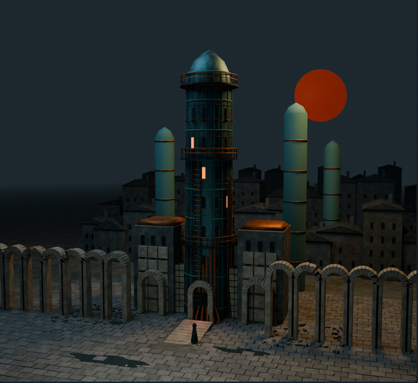
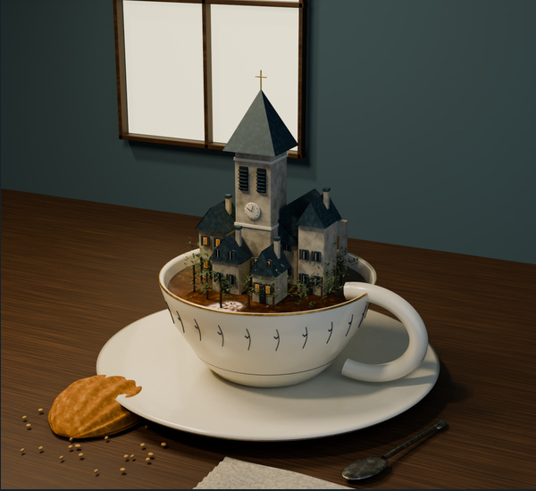
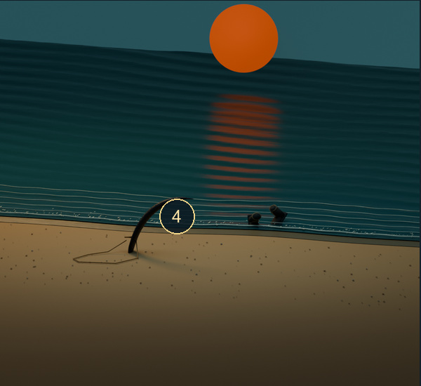
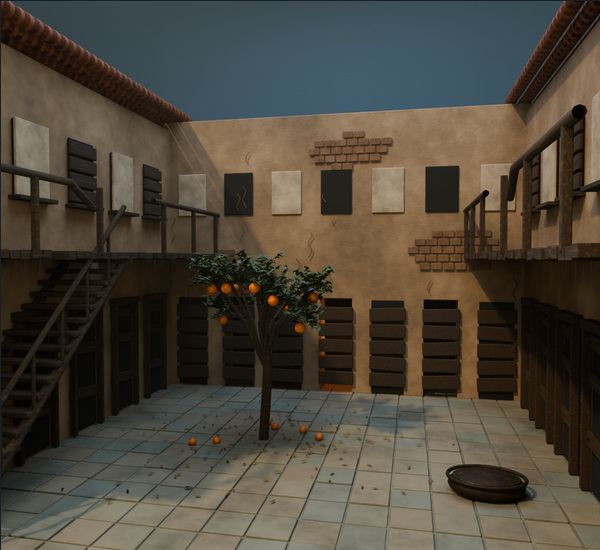

# Sam Mausberg

GPU systems, compilers, and mathematics. Based in Vancouver.

I'm building [FindTensor](https://findtensor.com), an experimental compiler and runtime for LLM inference.

## Work

1. **[KernelIndex](https://github.com/SamMausberg/KernelIndex)** — A searchable index of GPU kernels and benchmark evidence.
2. **[B200 kernels](https://github.com/SamMausberg/sol-execbench-b200-kernels)** — CUDA C++ and CuTe DSL implementations for SOL-ExecBench.
3. **[H100 serving estimator](https://github.com/SamMausberg/h100-serving-estimator)** — GPU time per request, studied across 91 published vLLM runs.
4. **[SmolLM2 conformance](https://github.com/SamMausberg/smollm2-cpu-conformance)** — CPU numerical checks for full-sequence and KV-cache inference.
5. **[Tensor parallel reference](https://github.com/SamMausberg/tensor-parallel-reference)** — A process-isolated decoder reference running on CPUs.
6. **[FlashInfer](https://github.com/SamMausberg/flashinfer)** — My fork of FlashInfer, a kernel library for LLM serving.

I also worked with Professor [Tor Aamodt](https://ece.ubc.ca/tor-aaamodt/) at UBC ECE on GPU architecture modeling in GPGPU-Sim.

[Lean formalizations](https://github.com/SamMausberg/lean-formalizations): work on Erdős problems 119 and 885 in Lean 4 and mathlib.

 

The pictures open repositories. Blender scenes from Wolfe, Proust, and Donoso; portrait after Sam Weber. <a href="art/README.md">Scenes &amp; source</a>.

Books

*The Book of the New Sun* is my favorite. I love miserable books.

- **Gene Wolfe:** *The Book of the Long Sun*, *The Book of the Short Sun*, *Peace*.
- **José Donoso:** *The Obscene Bird of Night*.
- **Sadegh Hedayat:** *The Blind Owl*.
- **Samuel R. Delany:** *Dhalgren*.
- **Thomas Pynchon:** *Gravity's Rainbow*.
- **James Joyce:** *Ulysses*.
- **Mikhail Bulgakov:** *The Master and Margarita*.
- **Fernando Pessoa:** *The Book of Disquiet*.
- **Marcel Proust:** *In Search of Lost Time*.
- **Cormac McCarthy:** *Blood Meridian*.
- **Vladimir Nabokov:** *Pale Fire*.
- **William H. Gass:** *The Tunnel*.

### Want to read

- **Julien Gracq:** *The Opposing Shore*.
- **Mircea Cărtărescu:** *Blinding: Book One*.
- **Bruno Schulz:** *The Street of Crocodiles and Other Stories*.
- **Sylvie Germain:** *The Book of Nights*.
- **László Krasznahorkai:** *Seiobo There Below*.
- **Hermann Broch:** *The Death of Virgil*.
- **Mercè Rodoreda:** *Death in Spring*.
- **Carlos Fuentes:** *Terra Nostra*.
- **Leonid Tsypkin:** *Summer in Baden-Baden*.

---

[FindTensor](https://findtensor.com) · [LinkedIn](https://www.linkedin.com/in/sam-mausberg) · [Email](mailto:samuelmausberg@gmail.com)
